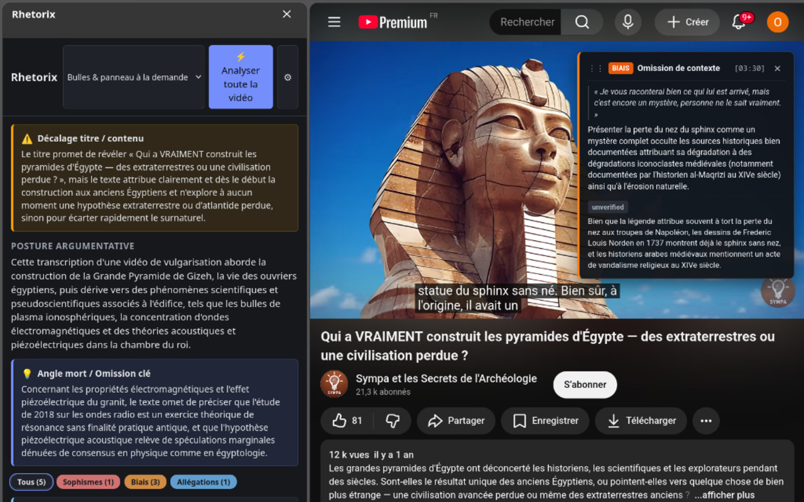

# Rhetorix

Extension de navigateur (Manifest V3) pour **Chromium** (Chrome, Brave, Edge) et **Firefox**, desktop et Android. Elle analyse un article de presse, une interview ou une vidéo YouTube avec le LLM de votre choix, surligne les sophismes, biais et allégations factuelles, et explique chacun d'eux.



> **Statut : v0.1, en développement.** Voir les [points ouverts](docs/fonctionnelles/points-ouverts.md).

## Fonctionnalités

### Analyse d'articles

- **Extraction propre** du texte avec Mozilla Readability, sans publicités, menus ni bannières.
- **Surlignage dans la page** des passages relevés, avec la CSS Custom Highlight API : le texte de la page n'est pas modifié. Une couleur par catégorie : rouge pour les sophismes, orange pour les biais, bleu pour les allégations factuelles.
- **Taxonomie fermée de 39 étiquettes** : 19 sophismes, 12 biais et 8 types d'allégations factuelles, chacune avec sa définition. Chaque annotation indique sa **gravité** (faible, moyenne, élevée), la **confiance** du modèle et une critique rhétorique.
- **Lecture d'ensemble du document** : la posture argumentative, le **décalage entre le titre et le contenu** (titre racoleur ou trompeur) et l'**angle mort** (contre-argument ou consensus omis).
- **Défauts de structure** de l'argumentation, sans passage précis (conclusion sans lien avec les prémisses, contradiction interne…) : regroupés dans le panneau et accessibles depuis le titre surligné de l'article ou de la vidéo.
- **Articles longs** : au-delà d'une taille réglable, l'article est découpé par paragraphes, analysé en plusieurs appels, puis un résumé global est produit.
- **Affichage progressif** : les annotations apparaissent au fil de la réponse du LLM, sans attendre la fin de l'analyse.

### Vérification factuelle

- Avec la recherche web activée, chaque allégation est confrontée à des sources et reçoit un statut : **confirmée**, **réfutée**, **trompeuse** ou **non vérifiée**.
- **Sources fiables uniquement** : seules les URL issues de l'outil de recherche web du fournisseur sont affichées. Une URL citée de mémoire par le modèle est écartée.
- **Vérification à la demande** : une allégation restée non vérifiée peut être vérifiée en ligne depuis sa carte ou sa bulle, en un appel avec la recherche web activée pour lui seul, même si la recherche web est désactivée dans les options. Le résultat est gardé en cache.
- **Études scientifiques** : pour une allégation qui repose sur une étude, le modèle vérifie qu'elle est rapportée fidèlement et indique son **niveau de preuve** (méta-analyse, essai contrôlé, étude observationnelle, animale ou in vitro, prépublication). Si l'étude a un DOI, sa notice est vérifiée auprès de Crossref : revue, année, et signalement d'une **prépublication** ou d'un **article rétracté**. Les **financeurs** et la **déclaration d'intérêts des auteurs** sont cités tels quels, depuis Crossref ou, pour une étude biomédicale, PubMed.

### Vidéos YouTube

- **Analyse de la transcription** en version originale (sous-titres manuels, sinon automatiques), avec des explications rédigées dans votre langue. Fonctionne aussi sur les Shorts.
- **Analyse par tranches de 15 minutes** au fil de la lecture (durée réglable), ou **de toute la vidéo** en un clic.
- **Bulles sur le lecteur** au moment où le passage est prononcé, déplaçables par glisser-déposer, avec une durée d'affichage minimale réglable.
- **Pause automatique** avant ou après un passage relevé, avec reprise manuelle ou après un compte à rebours.
- **Marqueurs sur la barre de lecture** : la position de chaque annotation, en couleur, et les tranches déjà analysées. Un clic sur un marqueur ou sur l'horodatage d'une carte place la vidéo au début du passage.
- Mise en veille pendant les publicités, et réinitialisation au passage à une autre vidéo.

### Affichage et interaction

- **Trois modes d'affichage** :
  - **Bulles & panneau à la demande** (par défaut) : le panneau latéral et les bulles au survol des passages surlignés ;
  - **Bulles au survol uniquement** : l'icône ouvre une petite fenêtre pour lancer l'analyse et en voir le bilan ;
  - **Panneau latéral uniquement**.
- **Panneau latéral** : une carte par annotation, des filtres par catégorie avec leurs compteurs, l'annulation d'une analyse en cours.
- **Synchronisation dans les deux sens** : un clic sur une carte fait défiler la page jusqu'à la citation, et un clic sur une citation met sa carte en avant.
- **Au toucher** : toute information accessible au survol l'est aussi au toucher.
- **Contester une annotation** : elle est repliée et enregistrée dans le navigateur. Les options la listent, et permettent de la signaler aux mainteneurs par un ticket GitHub prérempli, que vous relisez et publiez vous-même (l'adresse de la page est facultative).
- **Thème clair et sombre**, selon celui du système.
- **Cinq langues** pour l'interface et les analyses : français, anglais, espagnol, allemand et italien.

### Cache et consommation

- **Cache par URL** : une page déjà analysée s'affiche à nouveau sans nouvel appel. **Ré-analyser** force un nouvel appel, et le cache peut être vidé depuis les options.
- **Suivi des tokens** consommés, affiché pendant l'analyse et cumulé dans les options, avec une remise à zéro manuelle ou mensuelle à la date de votre choix, et des liens vers la page de quotas de chaque fournisseur.
- L'analyse se poursuit si l'on ferme le panneau ou si l'on change d'onglet.

### Firefox pour Android

Pas de panneau latéral : Rhetorix se lance depuis le menu **⋮ > Extensions**. Un message bref indique l'avancement, puis un toucher sur un passage surligné ouvre son explication dans une bulle.

## Fournisseurs LLM

Rhetorix fonctionne avec votre propre clé, ou sans clé avec un modèle local :

| Fournisseur | Clé | Recherche web |
|---|---|---|
| **Chrome Built-in AI** (Gemini Nano) | Aucune : exécution 100 % locale, Chromium 128+ | Non |
| **Google Gemini** | Gratuite via Google AI Studio (lien direct dans les options) | Grounding Google Search, avec un compte de facturation |
| **Compatible OpenAI** : Ollama local (configuration en un clic), LM Studio, Mistral, OpenRouter, Perplexity… | Facultative en local | Selon le service (Perplexity, OpenRouter `:online`…) |
| **Anthropic** (Claude) | Payante | Outil de recherche web d'Anthropic |

La liste des modèles disponibles est récupérée auprès du fournisseur ; une saisie libre reste possible.

## Installation

### Depuis les sources

Prérequis : Node.js 22.12 ou plus récent.

```sh
npm ci
npm run build      # génère dist/chrome et dist/firefox
```

**Chromium (≥ 128)** : ouvrir `chrome://extensions`, activer le **mode développeur**, puis **Charger l'extension non empaquetée** et choisir `dist/chrome`.

**Firefox (≥ 142)** : ouvrir `about:debugging#/runtime/this-firefox`, puis **Charger un module complémentaire temporaire** et choisir `dist/firefox/manifest.json`. Autre possibilité : `npx web-ext run -s dist/firefox`.

**Firefox pour Android (≥ 142)** : téléphone branché en USB avec le débogage activé, puis `npx web-ext run -s dist/firefox -t firefox-android --android-device <id>` (liste des appareils : `adb devices`).

### Configuration

Ouvrir les options de l'extension, choisir le fournisseur, saisir la clé API et le modèle, puis enregistrer. Le navigateur demande alors l'autorisation d'accéder à l'API du fournisseur. Les options proposent aussi un onglet **Capacités & Charte** qui décrit les couleurs, statuts, niveaux de gravité et toutes les étiquettes.

## Utilisation

1. Ouvrir un article, puis cliquer sur l'icône Rhetorix.
2. Cliquer sur **Analyser la page**.

Sur YouTube, choisir **Analyser (15 min)** ou **Analyser toute la vidéo**, puis lancer la lecture.

## Développement

```sh
npm run watch          # reconstruit à chaque modification
npm test               # tests unitaires (vitest)
npm run typecheck      # tsc --noEmit
npm run lint:firefox   # web-ext lint sur dist/firefox
npm run test:live      # banc d'essai en direct des API LLM (Anthropic, Gemini, OpenAI)
npm run package        # paquets Chrome et Firefox, et archive des sources, dans artifacts/
```

Chaque paquet contient `LICENSE` et `THIRD_PARTY_LICENSES.txt`, la liste des licences des bibliothèques embarquées.

Pousser un tag `v*` publie la version sur le Chrome Web Store et addons.mozilla.org, après approbation : voir [docs/techniques/publication.md](docs/techniques/publication.md).

### Structure

```
build.mjs                 # build esbuild, manifest par navigateur, licences
src/
  background.ts           # ouverture du panneau, messages, déclenchement mobile
  runner.ts               # pilotage d'une analyse par onglet (script de fond)
  content-script.ts       # extraction (Readability), surlignage, clics et touchers
  annotation-popover.ts   # bulle d'annotation et message bref dans la page (Shadow DOM)
  content-script-youtube.ts # transcription, lecteur et bulles sur YouTube
  youtube/                # détection, transcription, alignement temporel, lecteur, overlay
  sidepanel/              # panneau : déclenchement, cartes, streaming, filtres
  popup/                  # fenêtre de l'icône en mode bulles seules
  options/                # options : fournisseur, modèle, YouTube, tokens, guide
  providers/              # adaptateurs anthropic, gemini, openai-compatible, chrome-ai
  analyze.ts              # orchestration : découpage, appels, validation, fusion
  verify.ts               # vérification en ligne d'une allégation à la demande
  studies.ts              # notice des études citées : Crossref, puis PubMed
  crossref.ts             # notice Crossref (DOI, rétractation, financeurs, déclarations)
  pubmed.ts               # déclaration d'intérêts des auteurs dans PubMed
  evidence-view.ts        # affichage du niveau de preuve
  contested.ts            # annotations contestées et ticket GitHub prérempli
  streaming-json.ts       # parseur de flux JSON progressif
  schema.ts               # contrat JSON du LLM, validation, politique des sources
  taxonomy.ts             # taxonomie fermée de 39 étiquettes, en 5 langues
  i18n.ts                 # textes d'interface et erreurs (fr, en, es, de, it)
  text-match.ts           # localisation des citations dans la page
  tokens.ts               # suivi de la consommation de tokens
  chunking.ts, cache.ts, config.ts, prompt.ts, messages.ts, ext.ts
  icons/                  # icônes SVG et PNG
scripts/
  test-live-provider.mjs  # banc d'essai des providers LLM réels
test/                     # tests unitaires des modules purs
docs/
```

## Documentation

| Document | Contenu |
|---|---|
| [docs/fonctionnelles/specification.md](docs/fonctionnelles/specification.md) | PRD : vision, composants, schéma JSON attendu du LLM, parcours utilisateur |
| [docs/fonctionnelles/spec-youtube.md](docs/fonctionnelles/spec-youtube.md) | Spécification du module YouTube et de la synchronisation vidéo |
| [docs/fonctionnelles/points-ouverts.md](docs/fonctionnelles/points-ouverts.md) | Décisions prises, points restant à préciser, risques |
| [docs/techniques/architecture.md](docs/techniques/architecture.md) | Composants, flux de messages, providers, cache, compatibilité des navigateurs |
| [docs/techniques/architecture-youtube.md](docs/techniques/architecture-youtube.md) | Architecture du module YouTube |
| [CLAUDE.md](CLAUDE.md) | Consignes pour les agents de code travaillant sur le dépôt |

## Confidentialité

Rhetorix n'a pas de serveur. Le texte analysé est envoyé uniquement au fournisseur LLM que vous avez configuré, ou reste sur votre appareil avec un modèle local. Pour vérifier une étude citée, seul son DOI est envoyé à Crossref et, pour une étude biomédicale, à PubMed. La clé API est stockée localement dans le navigateur, sans synchronisation. Aucune télémétrie. Détails dans la [politique de confidentialité](PRIVACY.md).

## Contribuer

Questions, bugs et suggestions : [ouvrir un ticket](https://github.com/oliiivier/rhetorix/issues).

## Licence

[MIT](LICENSE). Les bibliothèques embarquées gardent leur propre licence, listée dans `THIRD_PARTY_LICENSES.txt` de chaque paquet.
