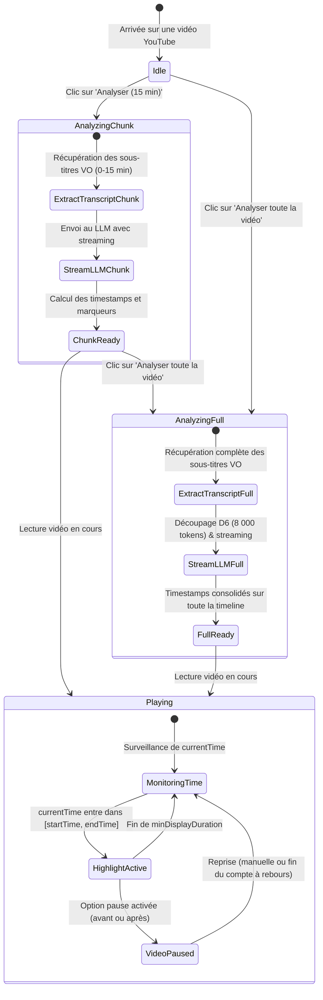

# Spécification fonctionnelle — Module YouTube & Synchronisation vidéo

## 1. Vision et Objectifs produit

Cette spécification définit le comportement fonctionnel de **Rhetorix** lors de la navigation sur YouTube (`https://www.youtube.com/watch*` et `https://www.youtube.com/shorts/*`).

Contrairement aux articles web textuels où l'analyse est spatialisée dans le DOM (paragraphes, sélections de texte), l'analyse d'une vidéo repose sur un **repérage temporel continu** :
1. Extraire la transcription officielle ou générée par reconnaissance vocale (ASR) avec ses horodatages précis.
2. Analyser les propos en Version Originale (VO) tout en produisant les critiques et les vérifications factuelles dans la langue de l'interface utilisateur (internationalisation).
3. Déclencher l'analyse **uniquement à la demande explicite de l'utilisateur**, par défaut **par tranches de 15 minutes au fil de la lecture**, avec possibilité d'étendre à tout moment l'analyse à l'intégralité de la vidéo.
4. Afficher des infobulles interactives incrustées sur le lecteur (overlay en coin supérieur droit, déplaçable par glisser-déposer, compatible plein écran) ou dans le panneau latéral.
5. Permettre la configuration fine de la durée minimale d'affichage et de la mise en pause de la vidéo (avant/après le passage, avec reprise manuelle ou compte à rebours automatique).
6. Offrir une navigation bidirectionnelle instantanée : le clic sur un élément du panneau latéral ou sur un marqueur de la barre de progression avance la vidéo directement au début du passage litigieux.

---

## 2. Parcours utilisateur et États de l'interface



---

## 3. Extraction de la transcription (VO) & Horodatage

### 3.1 Détection et choix de la piste de sous-titres
- **Langue d'analyse** : L'analyse s'effectue obligatoirement sur la **Version Originale (VO)** de la vidéo afin d'éviter les contresens, les biais de traduction ou les approximations introduits par les doublages ou traductions automatiques.
- **Priorité des pistes** :
  1. Piste manuelle créée par l'auteur dans la langue originale de la vidéo.
  2. Piste automatique (ASR) générée par YouTube dans la langue originale.
- **Récupération des segments** :
  Chaque segment extrait comporte son texte brut et son intervalle chronométré :
  $$\text{Segment} = \{ \text{startMs}: \text{number}, \, \text{endMs}: \text{number}, \, \text{text}: \text{string}, \, \text{charStart}: \text{number}, \, \text{charEnd}: \text{number} \}$$

### 3.2 Cas d'indisponibilité
Si la vidéo ne dispose d'aucun sous-titre (désactivés par le créateur, musique, flux en direct sans transcription disponible) :
- Le panneau affiche un état dédié : *"Aucune transcription disponible pour cette vidéo."*
- Les boutons d'analyse sont désactivés avec une infobulle explicative.

---

## 4. Politique d'analyse : Tranches de 15 min vs Analyse intégrale

L'analyse ne se lance jamais automatiquement sans intervention de l'utilisateur.

### 4.1 Analyse par tranches de 15 minutes (Mode par défaut)
- **Objectif** : Réactivité maximale, économie de tokens LLM et temps de traitement quasi-instantané.
- **Fonctionnement** :
  - L'utilisateur clique sur **« Analyser (15 min) »**.
  - Rhetorix extrait et analyse les 15 premières minutes de la vidéo (ou une fenêtre de 15 minutes centrée autour de la tête de lecture si l'utilisateur a déjà avancé dans la vidéo).
  - Au fur et à mesure de la lecture, lorsque la vidéo atteint la 13e minute de la tranche courante, Rhetorix précharge et analyse en arrière-plan la tranche suivante (15:00 à 30:00).
- **Indicateur de tranche** : Le panneau affiche un indicateur de couverture : `Tranche 1/4 analysée (00:00 - 15:00)`.

### 4.2 Analyse intégrale (« Analyser toute la vidéo »)
- **Objectif** : Disposer d'une vision exhaustive de la rhétorique de la vidéo, d'une synthèse globale, du diagnostic de putaclic (`clickbait_gap`), de l'angle mort (`blind_spot`) et d'une barre latérale complète dès le départ.
- **Fonctionnement** :
  - Disponible d'emblée via un menu/bouton secondaire, ou à tout moment pendant/après l'analyse d'une tranche.
  - La transcription complète est découpée selon la politique D6 (morceaux de 8 000 tokens) traités en parallèle par le script de fond.
  - Les timestamps de chaque segment restent absolus et sont indexés sur la durée totale de la vidéo.

### 4.3 Ergonomie des boutons et Sablier d'attente

| Phase | Bouton principal | Bouton secondaire / Action contextuelle | Indicateur visuel |
|---|---|---|---|
| **Non analysé** | **⚡ Analyser (15 min)** | ▾ *Analyser toute la vidéo* | Repos (aucun marqueur) |
| **Analyse 15 min en cours** | **⏳ Analyse 00:00 - 15:00...** | **⚡ Analyser toute la vidéo** | Sablier animé + progression des segments |
| **Tranche prête** | **⚡ Analyser toute la vidéo** | ↻ *Réanalyser la tranche* | Marqueurs 0-15 min visibles sur la timeline |
| **Saut vers zone non analysée** | **⏳ Analyse 50:00 - 65:00...** | **⚡ Analyser toute la vidéo** | Sablier animé contextuel + toast discret |
| **Analyse intégrale en cours** | **⏳ Analyse complète en cours...** | ✕ *Annuler* | Sablier animé + jauge (ex: tranches 2/5) |
| **Analyse intégrale prête** | ↻ *Réanalyser la vidéo* | *Filtres par catégorie (Tous / Sophismes / Biais / Faits)* | Timeline 100% annotée |

### 4.4 Déplacement rapide de l'utilisateur (Seek & Sauts temporels vers la 20e ou 50e minute)

L'utilisateur peut à tout instant utiliser la barre de défilement YouTube, les touches de raccourci (`J`, `L`, chiffres `0`-`9`) ou cliquer sur les chapitres natifs pour avancer brutalement dans la vidéo (ex: saut direct de la 3e minute à la 20e ou 50e minute).

#### Comportement lors d'un saut vers une zone déjà analysée (ex: retour en arrière)
- **Instantanéité** : Les annotations et marqueurs de la tranche déjà analysée sont réactivés immédiatement depuis le cache mémoire sans aucun appel LLM.
- **Synchronisation** : La carte correspondante dans le panneau latéral s'illumine et l'infobulle s'affiche si le curseur atterrit sur un moment litigieux.

#### Comportement lors d'un saut vers une zone non analysée (ex: saut à 20:00 ou 50:00)
Si l'analyse au fil de la lecture a été initialement activée par l'utilisateur :
1. **Annulation des tranches devenues hors champ** : Si un préchargement de la tranche intermédiaire (ex: 15-30 min) était en cours ou planifié, il est immédiatement annulé pour économiser les tokens et la bande passante.
2. **Fermeture de l'infobulle précédente** : Toute bulle active issue de l'ancienne position est masquée instantanément.
3. **Recalage automatique de la tranche d'analyse** :
   - Rhetorix détecte le nouvel instant `currentTime` (ex: `50:00`).
   - Une nouvelle tranche de 15 minutes est aussitôt définie : de `50:00` à `65:00` (ou jusqu'à la fin de la vidéo).
   - L'analyse de cette tranche est lancée en streaming.
4. **Retour visuel clair (IHM & Sablier contextuel)** :
   - Le bouton principal du panneau latéral affiche : **`⏳ Analyse en cours (50:00 - 65:00)...`** avec le sablier animé.
   - Une pastille ou toast discret apparaît brièvement sur le lecteur vidéo : *« ⏳ Analyse de la tranche 50:00 - 65:00... »*.
   - Le bouton secondaire **`⚡ Analyser toute la vidéo`** reste mis en avant pour permettre d'analyser l'intégralité d'un clic si l'utilisateur compte encore zapper fréquemment.
5. **Conservation cumulative en cache (Multi-tranches)** :
   - Les tranches analysées précédemment ne sont pas écrasées : elles sont conservées dans la session. Si l'utilisateur revient ensuite à la 5e minute, les données sont immédiatement là.
   - La barre de progression YouTube affiche en surbrillance subtile (fine barre d'arrière-plan) l'ensemble des zones temporelles déjà analysées (ex: `00:00-15:00` et `50:00-65:00`).

---

## 5. Synchronisation de la lecture vidéo

Le content script surveille en temps réel l'événement `timeupdate` et la propriété `currentTime` de l'élément `<video>` du lecteur YouTube.

### 5.1 Alignement des citations et plages d'activation
- Pour chaque annotation validée par le LLM, la citation `exact_quote` (en VO) est retrouvée dans les segments horodatés.
- Les bornes temporelles `[startTime, endTime]` (en secondes) sont rattachées à l'annotation.
- L'annotation devient **active** lorsque :
  $$\text{currentTime} \ge \text{startTime} \quad \text{et} \quad \text{currentTime} \le \max(\text{endTime}, \text{startTime} + \text{minDisplayDuration})$$

### 5.2 Durée minimale d'affichage (`minDisplayDuration`)
- Un sophisme ou un argument fallacieux peut être prononcé en seulement 2 secondes à l'oral.
- L'utilisateur peut régler dans les options une durée minimale d'affichage (plage : **3 à 20 secondes**, valeur par défaut : **6 secondes**).
- La bulle reste affichée au minimum pendant cette durée, même si la citation orale est terminée, sauf si l'utilisateur la ferme ou qu'une nouvelle annotation prend le relais.

### 5.3 Gestion des modes de pause automatique

Trois modes de pause sont configurables dans les options :

1. **Aucune pause (`none`) — Mode par défaut** :
   - La vidéo ne s'interrompt pas.
   - La bulle apparaît au-dessus de la vidéo pendant la durée minimale requise.
2. **Pause avant le passage (`pause_start`)** :
   - Dès que `currentTime >= startTime`, la vidéo est mise en pause (`video.pause()`).
   - L'utilisateur lit la description du sophisme ou du biais avant d'entendre la phrase.
3. **Pause après le passage (`pause_after`)** :
   - La vidéo joue le passage normalement.
   - Dès que `currentTime >= endTime`, la vidéo se met automatiquement en pause.
   - L'utilisateur a entendu l'argument en contexte et peut lire l'explication et les sources sans rater la suite du discours.

### 5.4 Reprise de lecture (Resume) : Manuel vs Compte à rebours
Lorsque la vidéo a été mise en pause automatiquement, deux options de reprise sont proposées :
- **Mode A : Reprise manuelle** :
  - La vidéo reste en pause indéfiniment jusqu'à une action utilisateur :
    - Touche Espace ou clic sur la vidéo YouTube ;
    - Clic sur le bouton **« Reprendre »** intégré à l'infobulle Rhetorix.
- **Mode B : Compte à rebours automatique (Auto-resume)** :
  - L'infobulle affiche une jauge ou un texte dynamique : `Reprise dans 5s...` (durée réglable de 3 à 15s).
  - À l'expiration du compte à rebours, la lecture reprend automatiquement (`video.play()`).
  - **Sécurité ergonomique** : Si l'utilisateur survole la bulle avec la souris ou interagit avec celle-ci (ex: clic pour déplier les sources), le compte à rebours est immédiatement figé.

---

## 6. Ergonomie de l'Infobulle In-Player (Overlay)

L'infobulle est encapsulée dans un Shadow DOM inséré au sein du conteneur `#movie_player` pour garantir :
- L'isolation CSS totale face aux styles de YouTube ;
- La persistance et la visibilité parfaite en **mode plein écran**.

### 6.1 Disposition et Ancrage par défaut
- **Emplacement par défaut** : **Coin supérieur droit** du lecteur vidéo (`top: 16px`, `right: 16px`). Cet emplacement ne masque ni les visages des orateurs au centre, ni les sous-titres natifs en bas, ni la barre de contrôles.
- **Déplacement par glisser-déposer (Drag & Drop)** :
  - L'infobulle possède une zone de préhension (en-tête / poignée).
  - L'utilisateur peut la déplacer n'importe où sur l'espace du lecteur vidéo.
  - La dernière position choisie est mémorisée pour la session de visionnage.

### 6.2 Structure de l'infobulle
```
+-------------------------------------------------------------+
| [::: Poignée]  [Badge: Sophisme]  Homme de paille    [✕ Fermer] |
| Sévérité: Élevée                         Horodatage: 03:42  |
+-------------------------------------------------------------+
| « Citation exacte en VO prononcée par l'orateur... »        |
+-------------------------------------------------------------+
| Critique rhétorique (dans la langue de l'utilisateur) :      |
| L'orateur déforme la position adverse pour la réfuter...    |
+-------------------------------------------------------------+
| ▸ Vérification factuelle : Réfuté                           |
|   Source : Le Monde (lemonde.fr)                            |
+-------------------------------------------------------------+
| [ ▶ Reprendre la lecture (3s) ]                             |
+-------------------------------------------------------------+
```

### 6.3 Fermeture et interactions
- Bouton `✕` : ferme immédiatement l'infobulle en cours sans stopper la vidéo.
- Clic sur un lien source : ouvre la source dans un nouvel onglet sans couper la vidéo.

---

## 7. Marqueurs sur la barre de progression YouTube (Scrubber Markers)

Rhetorix injecte des indicateurs visuels au niveau de la barre de progression YouTube (`.ytp-progress-bar`) :
- **Zones de couverture temporelle** :
  - Les tranches déjà analysées (ex: 00:00 - 15:00 et 50:00 - 65:00) sont matérialisées par une fine bande d'arrière-plan semi-transparente le long de la barre de progression.
  - L'utilisateur voit immédiatement les parties de la vidéo qui sont déjà cartographiées et celles qui ne le sont pas encore.
- **Codes couleur normalisés des marqueurs** :
  - Rouge : Sophisme (`sophism`)
  - Orange : Biais cognitif ou argumentatif (`bias`)
  - Bleu : Allégation factuelle vérifiée ou contestée (`factual_claim`)
- **Interactions sur la timeline** :
  - **Survol d'un marqueur** : affiche un aperçu miniature avec l'étiquette et la citation.
  - **Clic sur un marqueur** : déplace immédiatement la vidéo au début du passage et affiche l'infobulle complète.

---

## 8. Synchronisation avec le Panneau Latéral

- **Ordre chronologique** : Les cartes du panneau latéral sont ordonnées selon leur apparition temporelle dans la vidéo.
- **Horodatage cliquable** : Chaque carte comporte un badge horodaté (ex: `▶ 04:15`).
- **Saut direct au clic (Seek)** :
  - Clic sur une carte $\rightarrow$ la vidéo avance immédiatement à `startTime` (`video.currentTime = startTime`).
  - L'infobulle In-Player s'ouvre aussitôt.
  - La vidéo se lance ou reste en pause selon le mode de pause configuré.
- **Suivi automatique pendant la lecture (Auto-scroll)** :
  - Au fur et à mesure que la vidéo progresse, la carte active est mise en valeur par une bordure illuminée.
  - Le panneau défile automatiquement pour garder la carte active au centre (débrayable si l'utilisateur fait défiler manuellement le panneau).

---

## 9. Options de Configuration (Écran Options)

La page d'options de Rhetorix s'enrichit d'une section **« Vidéos & YouTube »** :

| Paramètre | Type | Valeurs / Plage | Valeur par défaut |
|---|---|---|---|
| **Tranche d'analyse initiale** | Choix | 15 minutes / Vidéo entière | **15 minutes** |
| **Durée minimale d'affichage** | Slider | 3 à 20 secondes | **6 secondes** |
| **Comportement de pause** | Radio | Aucune pause / Pause avant le passage / Pause après le passage | **Aucune pause** |
| **Reprise de pause** | Radio | Reprise manuelle / Compte à rebours automatique | **Compte à rebours (5 s)** |
| **Affichage des marqueurs sur la timeline** | Toggle | Activé / Désactivé | **Activé** |
| **Position initiale de la bulle** | Sélecteur | Coin haut-droit / Coin haut-gauche / Bas au-dessus des contrôles | **Coin haut-droit** |

---

## 10. Gestion des cas limites et robustesse

1. **Publicités YouTube (pre-roll & mid-roll)** :
   - Détection de la présence de la classe `.ad-showing` ou des balises `.ytp-ad-player-overlay`.
   - Pendant une publicité, la détection temporelle et l'affichage des bulles sont mis en sommeil afin de ne pas fausser le minutage.
2. **Navigation interne YouTube (SPA / `yt-navigate-finish`)** :
   - YouTube ne recharge pas la page lors du passage d'une vidéo à une autre.
   - Rhetorix écoute l'événement `yt-navigate-finish`, réinitialise les marqueurs temporels et invite l'utilisateur à lancer l'analyse de la nouvelle vidéo.
3. **Accélération de la vitesse de lecture (1.5x, 2x)** :
   - La synchronisation temporelle s'appuie sur `currentTime` réel de la vidéo, restant parfaitement synchrone quelle que soit la vitesse choisie par l'utilisateur.
   - La durée minimale d'affichage s'exprime en temps réel (secondes réelles de l'horloge système) pour que l'utilisateur ait toujours le temps de lire confortablement.
