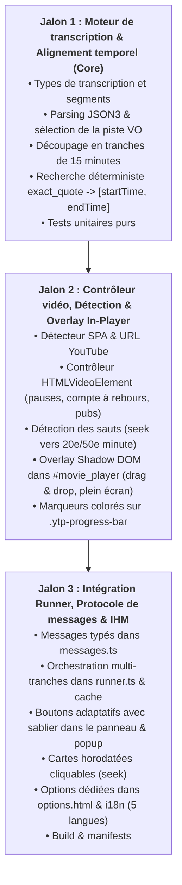

# Plan d'implémentation — Module YouTube & Synchronisation vidéo

Ce document détaille les jalons d'implémentation pour l'intégration du support YouTube dans Rhetorix, conformément aux [spécifications fonctionnelles](../fonctionnelles/spec-youtube.md) et à l'[architecture technique](../techniques/architecture-youtube.md).

---

## Vue d'ensemble des jalons

---

## Jalon 1 : Moteur de transcription & Alignement temporel (Core)

**Objectif** : Disposer des fonctions pures et testables pour extraire, découper et faire correspondre temporellement les citations issues de la transcription YouTube.

### Tâches détaillées :
1. **Types (`src/youtube/types.ts`)** :
   - Structure `TranscriptCue` (`startMs`, `endMs`, `text`, `charStart`, `charEnd`).
   - Structure `VideoTranscript` (`videoId`, `lang`, `durationMs`, `cues`, `fullText`).
   - Structure `VideoTranscriptSlice` (tranche découpée, `startSec`, `endSec`, `cues`, `text`).
   - Structure `CaptionTrackMeta` (métadonnées issues de YouTube : `baseUrl`, `vssId`, `languageCode`, `kind`).
   - Structure `VideoAnnotation` (annotation enrichie avec `startTime`, `endTime`, `chunkIndex`).
2. **Extraction et sélection VO (`src/youtube/youtube-transcript.ts`)** :
   - Sélection stricte de la piste VO : prioriser les sous-titres manuels dans la langue originale, puis ASR (automatique) dans la langue originale ; éliminer toute traduction automatique.
   - Parsing du format YouTube `timedtext` JSON3 : extraction des événements, calcul des temps en millisecondes et construction des index de caractères (`charStart`, `charEnd`).
   - Découpage par tranches (`sliceTranscript`) : extraction des segments chevauchant une fenêtre `[startSec, startSec + durationSec]` (par défaut 900s = 15 min).
   - Formatage du texte pour l'analyse LLM (`formatTranscriptForAnalysis`).
3. **Alignement temporel déterministe (`src/youtube/youtube-matcher.ts`)** :
   - Algorithme de correspondance : retrouver `exact_quote` (en VO) dans le texte de la tranche.
   - Normalisation robuste : gestion des espaces multiples, tirets, guillemets, césures de segments et casse.
   - Repli par recherche approximative / fenêtrage si nécessaire.
   - Dérivation mathématique exacte de `startTime = firstCue.startMs / 1000` et `endTime = lastCue.endMs / 1000`.
4. **Tests unitaires** :
   - `test/youtube-transcript.test.ts` : sélection VO, parsing de payload JSON3 réel, découpage temporel, gestion des cas vides/malformés.
   - `test/youtube-matcher.test.ts` : alignement parfait, alignement sur plusieurs segments consécutifs, gestion de la ponctuation, césures et citations introuvables (`unlocated`).

---

## Jalon 2 : Contrôleur vidéo, Détection & Overlay In-Player (Player & UI)

**Objectif** : Interagir directement avec le lecteur vidéo YouTube, synchroniser l'affichage avec la lecture, gérer les pauses/reprises et incruster l'infobulle ainsi que les marqueurs sur la timeline.

### Tâches détaillées :
1. **Détection d'URL & Cycle de vie SPA (`src/youtube/youtube-detector.ts`)** :
   - Détection des pages `youtube.com/watch*` et `youtube.com/shorts/*`.
   - Extraction de `videoId` et `currentTime` initial depuis les paramètres d'URL (`t=120s`).
   - Écoute de l'événement YouTube `yt-navigate-finish` pour réinitialiser l'état lors d'un changement de vidéo sans rechargement.
2. **Contrôleur du lecteur HTML5 (`src/youtube/youtube-player.ts`)** :
   - Accès sécurisé à `document.querySelector('video.html5-main-video')` et `#movie_player`.
   - Surveillance de `timeupdate` (interpolée via `requestAnimationFrame`).
   - Détection des publicités (`.ad-showing`) pour suspendre immédiatement l'overlay.
   - Gestion des modes de pause :
     - `none` : affichage avec durée minimale garantie (`minDisplayDuration`).
     - `pause_start` : pause à `startTime`.
     - `pause_after` : pause à `endTime`.
   - Gestion du compte à rebours de reprise automatique (avec gel au survol de la souris).
   - Détection des déplacements rapides (`seeking` / `seeked`) pour déclencher le recalage de tranche (ex: 20e ou 50e minute) et annuler les requêtes hors champ.
3. **Interface Shadow DOM In-Player (`src/youtube/youtube-overlay.ts`)** :
   - Injection d'un conteneur Shadow DOM dans `#movie_player` (garantissant la compatibilité plein écran).
   - Infobulle positionnée par défaut en haut à droite (`top: 16px; right: 16px`).
   - Gestion du Drag & Drop pour déplacer librement la bulle dans les limites de la vidéo.
   - Rendu des informations (badge, label taxonomique, sévérité, critique, sources de fact-checking, compte à rebours, bouton de reprise et fermeture).
4. **Marqueurs sur la barre de progression (`.ytp-progress-bar`)** :
   - Injection des zones couvertes (bande d'arrière-plan).
   - Injection des marqueurs d'annotations colorés aux pourcentages exacts.
   - Survol (infobulle miniature) et clic (saut immédiat à `startTime`).

---

## Jalon 3 : Intégration Runner, Protocole de messages & IHM (End-to-End)

**Objectif** : Relier le module YouTube au panneau latéral, au script de fond et à la page d'options pour une expérience utilisateur complète et fluide.

### Tâches détaillées :
1. **Protocole de messages (`src/messages.ts`)** :
   - Ajout des types `youtube-detect`, `youtube-extract`, `youtube-seek`, `youtube-time-update`, `youtube-analyze-chunk`, `youtube-analyze-full`.
2. **Orchestration dans le script de fond (`src/runner.ts`)** :
   - Prise en charge des transcriptions vidéo comme source d'analyse.
   - Pilotage des analyses par tranche (15 min) et globale.
   - Gestion du cache multi-tranches et annulation proactive (`AbortController`) lors des sauts de timeline.
3. **Panneau latéral & Popup (`src/sidepanel/sidepanel.ts`, `src/popup/popup.ts`)** :
   - Détection du mode YouTube sur l'onglet actif.
   - Boutons adaptatifs : `⚡ Analyser (15 min)`, `⏳ Analyse 00:00 - 15:00...` (avec sablier animé), `⚡ Analyser toute la vidéo`.
   - Cartes d'annotations enrichies d'un badge horodaté cliquable (ex: `▶ 04:12`) pour sauter instantanément au moment voulu.
   - Auto-scroll du panneau pour suivre la tête de lecture.
4. **Options utilisateur (`src/config.ts`, `src/options/options.ts`, `options.html`, `src/i18n.ts`)** :
   - Section « Vidéos & YouTube » dans les options.
   - Réglages : durée minimale d'affichage, mode de pause (`none`, `pause_start`, `pause_after`), mode de reprise (manuel vs compte à rebours), activation des marqueurs sur la timeline.
   - Traductions complètes dans les 5 langues supportées (`fr`, `en`, `es`, `de`, `it`).
5. **Build, Manifests & Tests globaux** :
   - Déclaration des fichiers dans `build.mjs` (injection du content script YouTube).
   - Vérification complète : `npm test`, `npm run typecheck`, `npm run build`, `npx web-ext lint`.
