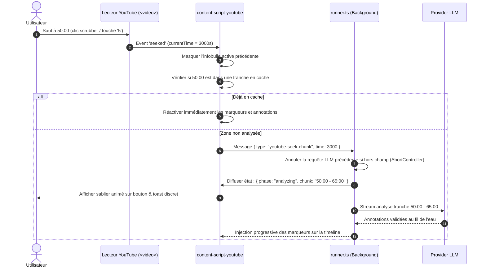

# Architecture technique — Module YouTube & Synchronisation vidéo

Complément à l'[architecture générale](architecture.md) détaillant la conception technique, les flux de données et l'implémentation du support YouTube pour Rhetorix.

---

## 1. Vue d'ensemble des composants

```
┌─────────────────────────── YouTube DOM / Player ──────────────────────────┐
│                                                                           │
│  ┌─────────────────────── #movie_player (Player) ──────────────────────┐  │
│  │                                                                     │  │
│  │   <video.html5-main-video>  ──(timeupdate, seeking, seeked, pause)──┤  │
│  │                                                                     │  │
│  │   <div id="rhetorix-yt-overlay"> (Shadow DOM - In-Player)           │  │
│  │   ├── Infobulle déplaçable (Drag & Drop, Top-Right par défaut)      │  │
│  │   └── Compte à rebours / Bouton 'Reprendre'                         │  │
│  │                                                                     │  │
│  │   .ytp-progress-bar (Barre de progression native)                   │  │
│  │   ├── Zones analysées (background highlights)                       │  │
│  │   └── Marqueurs d'annotations colorés (sophismes, biais, faits)     │  │
│  └─────────────────────────────────────────────────────────────────────┘  │
└─────────────────────────────────────┬─────────────────────────────────────┘
                                      │
                 injection au besoin  │  messages :
                 et écoute SPA        │  - extract-youtube / result
                                      │  - youtube-highlight / youtube-seek
                                      │  - youtube-status-change
                                      │
┌──────────────────────── content-script-youtube.ts ────────────────────────┐
│ - youtube-detector.ts   : Détection d'URL, extraction videoId, écoute SPA │
│ - youtube-transcript.ts : Extraction sous-titres VO (timedtext / json3)   │
│ - youtube-matcher.ts    : Alignement exact_quote -> [startTime, endTime]  │
│ - youtube-player.ts     : Contrôle vidéo, détection pubs, gestion pauses  │
│ - youtube-overlay.ts    : Rendu Shadow DOM, Drag & Drop, Scrubber markers │
└─────────────────────────────────────┬─────────────────────────────────────┘
                                      │
┌───────────────────────── background.js (runner.ts) ───────────────────────┐
│ Pilote les analyses :                                                     │
│ - Gestion des tranches de 15 min vs analyse intégrale                     │
│ - Annulation / recyclage des requêtes lors des sauts de timeline (seek)   │
│ - Orchestration LLM (analyzeArticle, streaming-json, politique D3)        │
│ - Cache multi-tranches en session (storage.local)                         │
└─────────────────────────────────────┬─────────────────────────────────────┘
                                      │
                 run-update           │  actions utilisateur :
                 (état + sablier)     │  - analyze-chunk (15 min)
                                      │  - analyze-full
                                      │  - seek-to-time
                                      ▼
┌──────────────────────────── sidepanel / popup ────────────────────────────┐
│ - Bouton adaptatif avec sablier : ⚡ Analyser (15 min) / ⏳ 00:00-15:00...│
│ - Bouton d'extension globale : ⚡ Analyser toute la vidéo                 │
│ - Cartes horodatées (badge ▶ 04:12) ordonnées chronologiquement           │
│ - Auto-scroll et surbrillance synchronisés avec currentTime               │
└───────────────────────────────────────────────────────────────────────────┘
```

---

## 2. Détection de navigation et cycle de vie SPA

YouTube est une Single Page Application (SPA) basée sur le framework Polymer (`ytd-app`). Le navigateur ne recharge pas la page lors de la navigation entre vidéos :

### 2.1 Événements de navigation écoutés
- **`yt-navigate-finish`** : Déclenché par YouTube dès qu'une navigation vers une nouvelle vidéo est terminée.
- **`spfdone`** : Repli pour les anciennes versions ou contextes particuliers.
- **`popstate` / `hashchange`** : Détection des retours en arrière dans l'historique.

### 2.2 Gestion de l'état lors d'un changement de vidéo
Lors de la détection d'un nouvel identifiant vidéo (`videoId`) :
1. Nettoyage immédiat : suppression des marqueurs sur la barre de progression, masquage de l'overlay, annulation des requêtes d'analyse en cours.
2. Déconnexion des écouteurs temporels de l'ancien élément `<video>`.
3. Réinitialisation de l'IHM du panneau : affichage de l'état prêt avec bouton `⚡ Analyser (15 min)`.
4. Recherche du nouvel élément `<video>` et réattachement des contrôleurs.

---

## 3. Extraction de la transcription (VO)

### 3.1 Découverte des pistes de sous-titres
Pour une vidéo YouTube (`https://www.youtube.com/watch?v=VIDEO_ID`), les métadonnées de sous-titres sont découvertes via :
1. **L'objet interne du lecteur** :
   ```typescript
   const player = document.getElementById("movie_player") as YouTubePlayerElement | null;
   const playerResponse = player?.getPlayerResponse?.() ?? window.ytInitialPlayerResponse;
   const tracks = playerResponse?.captions?.playerCaptionsTracklistRenderer?.captionTracks ?? [];
   ```
2. **Repli par inspection du DOM** : Extraction du JSON `ytInitialPlayerResponse` contenu dans les balises `<script>` du document hôte si l'objet n'est pas encore instancié.

### 3.2 Sélection de la piste VO
L'algorithme filtre et ordonne les pistes :
1. Pistes manuelles (`kind !== "asr"`) correspondant à la langue d'origine de la vidéo.
2. Pistes ASR (`kind === "asr"`) dans la langue d'origine de la vidéo.
3. Si plusieurs pistes existent, exclusion formelle des pistes traduites automatiquement (`isTranslatable` avec code langue cible différent de la source) afin de préserver la formulation mot-à-mot des propos oraux.

### 3.3 Récupération et normalisation des segments (Format JSON3)
La requête vers `captionTrack.baseUrl + "&fmt=json3"` renvoie une structure standard :
```json
{
  "events": [
    {
      "tStartMs": 1420,
      "dDurationMs": 2850,
      "segs": [{ "utf8": "Mes chers compatriotes," }]
    }
  ]
}
```
Cette réponse est transformée en une structure indexée :
```typescript
export interface TranscriptCue {
  startMs: number;
  endMs: number;
  text: string;
  charStart: number;
  charEnd: number;
}

export interface VideoTranscript {
  videoId: string;
  lang: string;
  durationMs: number;
  cues: TranscriptCue[];
  fullText: string;
}
```

---

## 4. Découpage par tranches (15 min) & Analyse

### 4.1 Découpage temporel (`sliceTranscript`)
Une fonction pure extrait les segments appartenant à une fenêtre temporelle donnée :
```typescript
function sliceTranscript(transcript: VideoTranscript, startSec: number, durationSec: number = 900): VideoTranscriptSlice {
  const startMs = startSec * 1000;
  const endMs = (startSec + durationSec) * 1000;
  const cues = transcript.cues.filter(c => c.endMs > startMs && c.startMs < endMs);
  const text = cues.map(c => c.text).join(" ");
  return { startSec, endSec: Math.min(startSec + durationSec, transcript.durationMs / 1000), cues, text };
}
```

### 4.2 Alignement temporel des citations (`youtube-matcher.ts`)
Lorsque le LLM renvoie une annotation avec `exact_quote` :
1. Recherche exacte de la citation dans `slice.text` normalisé (espaces, apostrophes, accents).
2. En cas de non-concordance (césure de mot ou légère correction typographique du LLM), recherche par fenêtrage flou (Levenshtein ou n-grammes de début/fin).
3. À partir des index de début et de fin de caractères trouvés ($C_{start}, C_{end}$), identification des cues couvertes :
   $$\text{startTime} = \text{firstCoveredCue.startMs} / 1000$$
   $$\text{endTime} = \text{lastCoveredCue.endMs} / 1000$$
4. L'annotation finale est enrichie :
   ```typescript
   export interface VideoAnnotation extends Annotation {
     startTime: number;
     endTime: number;
     chunkIndex: number;
   }
   ```

Une annotation d'ensemble (D12), sans citation, n'est pas alignée (`startTime` à -1) et ne compte pas parmi les citations non localisées. Elle est ancrée sur le titre de la vidéo affiché sous le lecteur (`ytd-watch-metadata h1`) : le content script le surligne (`rhetorix-document`, `highlights.css` injecté avec le script) et ouvre au survol ou au toucher une bulle `AnnotationPopover` qui liste ces annotations, avec l'action « Contester » (D15).

---

## 5. Gestion des Sauts (Seek) et Déplacement rapide

L'écouteur d'événement `seeking` et `seeked` sur l'élément `<video>` pilote la réactivité :



---

## 6. Contrôle du Lecteur & Gestion des Pauses

### 6.1 Boucle de synchronisation temporelle
Pour une fluidité optimale sans surcharger le processeur :
- Écoute principale : événement natif `timeupdate` de `<video>`.
- Interpolation précise : `requestAnimationFrame` throttlé à 10 Hz (toutes les 100 ms) pendant la lecture active.

### 6.2 Logique des modes de pause
```typescript
interface ActivePlaybackState {
  currentTime: number;
  lastPausedAnnotationId: string | null;
  resumeTimer: number | null;
}

function onPlaybackTick(currentTime: number, options: YouTubePlayOptions): void {
  // Ignorer si une publicité est en cours de diffusion
  if (isAdPlaying()) {
    hideOverlay();
    return;
  }

  for (const ann of currentAnnotations) {
    // Mode pause avant le passage
    if (options.pauseMode === "pause_start" && state.lastPausedAnnotationId !== ann.id) {
      if (currentTime >= ann.startTime && currentTime < ann.startTime + 0.5) {
        state.lastPausedAnnotationId = ann.id;
        videoElement.pause();
        showOverlay(ann, { withResumeCountdown: options.autoResume });
        return;
      }
    }

    // Mode pause après le passage
    if (options.pauseMode === "pause_after" && state.lastPausedAnnotationId !== ann.id) {
      if (currentTime >= ann.endTime && currentTime < ann.endTime + 0.5) {
        state.lastPausedAnnotationId = ann.id;
        videoElement.pause();
        showOverlay(ann, { withResumeCountdown: options.autoResume });
        return;
      }
    }

    // Affichage sans pause (ou passage en cours)
    const displayEnd = Math.max(ann.endTime, ann.startTime + options.minDisplayDuration);
    if (currentTime >= ann.startTime && currentTime <= displayEnd) {
      showOverlay(ann, { withResumeCountdown: false });
      return;
    }
  }
}
```

### 6.3 Gestion du compte à rebours de reprise (Auto-resume)
- Lorsque la vidéo est mise en pause avec compte à rebours activé :
  - L'infobulle affiche un compte à rebours décrémenté chaque seconde (`Reprise dans 5s...`).
  - À $t = 0$, `videoElement.play()` est exécuté.
  - **Suspension interactive** : Si l'utilisateur survole l'infobulle (`pointerenter`) ou clique sur un élément dépliable, le compte à rebours est suspendu (`clearInterval`). Il reprend dès la sortie (`pointerleave`).

---

## 7. Intégration dans le Lecteur (Shadow DOM & Plein Écran)

### 7.1 Ancrage dans `#movie_player`
Pour fonctionner de manière transparente en mode normal, mode cinéma (`theater mode`) et mode plein écran (`requestFullscreen`), l'élément hôte est injecté directement dans le conteneur du lecteur YouTube :
```typescript
const container = document.getElementById("movie_player") || document.querySelector(".html5-video-player");
const host = document.createElement("div");
host.id = "rhetorix-yt-overlay-host";
const shadow = host.attachShadow({ mode: "open" });
container.appendChild(host);
```

### 7.2 Glisser-déposer (Drag & Drop)
- L'en-tête de la bulle sert de poignée de glissement (`cursor: grab`).
- Les coordonnées `(x, y)` sont calculées relativement aux limites visibles de `#movie_player` (`getBoundingClientRect`).
- Contraintes : la bulle ne peut pas être déplacée en dehors du cadre visible de la vidéo.
- La position personnalisée est stockée dans `sessionStorage` pour persister tout au long de la session.

### 7.3 Marqueurs sur la barre de progression (`.ytp-progress-bar`)
- Les marqueurs sont des éléments `<div class="rhetorix-scrubber-marker">` insérés dans `.ytp-progress-bar`.
- Positionnement en pourcentage :
  $$\text{left} = \left(\frac{\text{startTime}}{\text{duration}}\right) \times 100\%$$
  $$\text{width} = \max\left(2\text{px}, \, \left(\frac{\text{endTime} - \text{startTime}}{\text{duration}}\right) \times 100\%\right)$$
- Une couche d'arrière-plan `.rhetorix-analyzed-zone` matérialise les plages déjà couvertes par l'analyse.

---

## 8. Messages et Protocole étendu (`src/messages.ts`)

| Message | Émetteur → Destinataire | Description / Charge utile |
|---|---|---|
| `youtube-detect` | panneau → content | Interroge la page pour savoir si une vidéo YouTube analysable est présente. |
| `youtube-extract` | fond → content | Extrait la transcription VO et renvoie `{ok: true, transcript}`. |
| `youtube-analyze-chunk` | panneau → fond | Déclenche l'analyse d'une tranche de 15 min `{startSec: number}`. |
| `youtube-analyze-full` | panneau → fond | Déclenche l'analyse exhaustive de la vidéo entière. |
| `youtube-seek` | panneau → content | Ordonne au lecteur de sauter à un timestamp `{time: number, pause?: boolean}`. |
| `youtube-highlight` | fond → content | Annotations alignées, tranches analysées et annotations d'ensemble à ancrer sur le titre `{annotations, analyzedRanges, lang?, documentAnnotations?}`. |
| `youtube-time-update` | content → panneau | Notifie le panneau du temps courant pour l'auto-scroll et la mise en surbrillance. |
| `youtube-set-options` | options/panneau → content | Met à jour les préférences de lecture (durée min, mode de pause, reprise). |

---

## 9. Sécurité et Conformité

1. **Aucun `innerHTML`** : L'infobulle et les marqueurs utilisent exclusivement les nœuds du DOM (`createElement`, `textContent`).
2. **Origine des sous-titres** : Seules les requêtes vers les sous-domaines officiels de YouTube (`*.youtube.com/api/timedtext*`) sont autorisées et traitées.
3. **Respect des directives du Chrome Web Store et Firefox AMO** :
   - Aucun script distant n'est chargé.
   - Les permissions nécessaires (`activeTab`, `scripting`, `storage`) restent strictement conformes au modèle de sécurité déjà en place.
